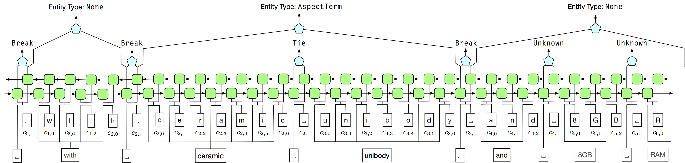

# AutoNER: Learning Named Entity Tagger using Domain-Specific Dictionary



## Publications

Please cite the following two papers if you are using our tool. Thanks!

- Jingbo Shang*, Liyuan Liu*, Xiaotao Gu, Xiang Ren, Teng Ren and Jiawei Han, "Learning Named Entity Tagger using Domain-Specific Dictionary", in Proc. of 2018 Conf. on Empirical Methods in Natural Language Processing (EMNLP'18), Brussels, Belgium, Oct. 2018. (* Equal Contribution)
- Jingbo Shang, Jialu Liu, Meng Jiang, Xiang Ren, Clare R Voss, Jiawei Han, "**[Automated Phrase Mining from Massive Text Corpora](https://arxiv.org/abs/1702.04457)**", accepted by IEEE Transactions on Knowledge and Data Engineering, Feb. 2018.


## Required Inputs

- **Tokenized Raw Texts**
  - Example: ```data/BC5CDR/raw_text.txt```
    - One token per line.
    - An empty line means the end of a sentence.
- **Two Dictionaries**
  - **Core Dictionary w/ Type Info**
    - Example: ```data/BC5CDR/dict_core.txt```
      - Two columns (i.e., Type, Tokenized Surface) per line.
      - Tab separated.
    - How to obtain?
      - From domain-specific dictionaries.
  - **Full Dictionary w/o Type Info**
    - Example: ```data/BC5CDR/dict_full.txt```
      - One tokenized high-quality phrases per line.
    - How to obtain? 
      - From domain-specific dictionaries.
      - Applying the high-quality phrase mining tool on domain-specific corpus.
        - [AutoPhrase](https://github.com/shangjingbo1226/AutoPhrase) 
- **Pre-trained word embeddings**
  - Train your own or download from the web.
- **[Optional]** Development & Test Sets.
  - Example: ```data/BC5CDR/truth_dev.ck``` and ```data/BC5CDR/truth_test.ck```
    - Three columns (i.e., token, ```Tie or Break``` label, entity type).
    - ```I``` is ```Berak```.
    - ```O``` is ```Tie```.
    - Two special tokens ```<s>``` and ```<eof>``` mean the start and end of the sentence.

## Dependencies

First, let's create a conda environment using Python 3 and pytorch 0.3.0.
```
conda create -n env_autoner python=3 mkl=2018 pytorch=0.3.0 -c pytorch -c intel
```
Then, activate this environment.
```
source activate env_autoner
```
Install some more packages (i.e., ```tqdm``` and ```tensorboardx```).
```
conda install -c conda-forge tqdm
conda install -c conda-forge tensorboardx
```

## Command

To train an AutoNER model, please run
```
./autoner_train.sh
```

To apply the trained AutoNER model, please run
```
./autoner_test.sh
```

You can specify the parameters in the bash files. The variables names are self-explained.
